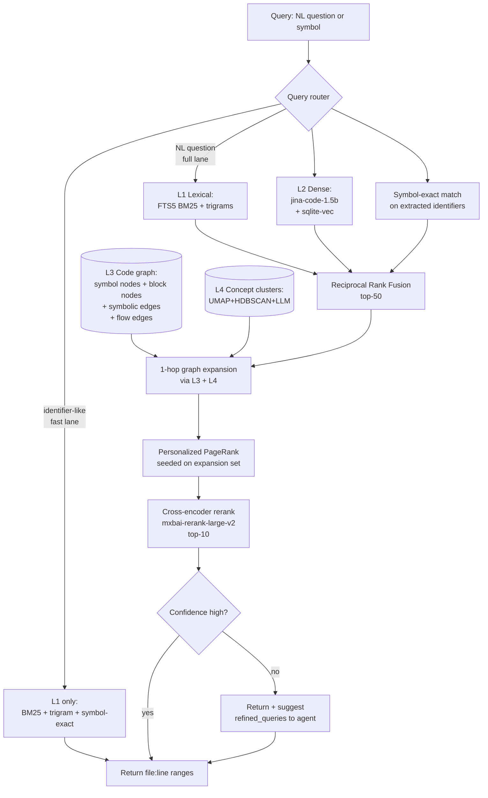

# codebase-vectorizer v1.0 — design

**Status:** Draft, awaiting review
**Date:** 2026-05-14
**Author:** Designed in collaboration with Josh, grounded in four parallel literature-research passes covering: code embedding models, AST chunking, code knowledge graphs, graph-augmented retrieval, and production code-search tools.

---

## TL;DR

codebase-vectorizer v1.0 is a **four-layer multi-modal code index** stored in a single `index.sqlite` file per repository:

1. **Lexical** — FTS5 BM25 over chunk text + custom identifier trigram index
2. **Dense semantic** — `jina-code-embeddings-1.5b` (1536-dim, INT8) in `sqlite-vec`
3. **Code graph** — heterogeneous typed nodes and edges covering symbol relationships (defines, calls, imports, inherits, references, contains) and intra-procedural flow (controls, dataflow, guards)
4. **Concept clusters** — UMAP + HDBSCAN over chunk embeddings, with one LLM-labeling pass at index time

Retrieval is a single pipeline with a fast lane (identifier-like queries → BM25 + trigram + symbol-exact, ≤100 ms) and a full lane (natural-language queries → hybrid seed → 1-hop graph expansion → Personalized PageRank → cross-encoder rerank, ≤5 s on CPU). When the full lane finishes with low confidence, it returns a `refined_queries` hint alongside the results; the calling agent decides whether to re-query.

Indexing is incremental via a Merkle tree of file hashes plus a content-hash-keyed embedding cache. Initial index of a typical 500K-LOC repo: ~10-13 min on CPU. Updating after small changes: seconds.

Goal: one expensive indexing pass; every subsequent agent query lands in ~5 s and ~500 tokens of context.

---

## Goals

1. **Accuracy.** State-of-the-art code retrieval. Target: ≥75 NDCG@10 averaged over CoIR domains. (Published number for the embedder we use is 78.94.)
2. **Recall.** Three orthogonal paths to relevance — lexical, semantic, and graph — so code that should be returned is not missed because any one signal fails.
3. **Relationship awareness.** The index models callers, callees, imports, inheritance, intra-procedural control flow, intra-procedural data flow, and concept membership — not just text similarity. AI agents can answer "what conditions cause X" or "what state does this input reach" without re-reading the repository.
4. **Single-file portability.** One `index.sqlite` per repo. Copy-pasteable across machines. No external services required at query time.
5. **Incremental.** Updating an index after small changes is seconds, not minutes.
6. **Cheap retrieval.** ≤5 s full-lane query on CPU, ≤200 ms fast-lane.
7. **Stable skill surface.** Existing `vectorize-repo` and `codebase-query` triggers and JSON outputs continue to work; a new `codebase-relate` skill handles explicit graph and flow queries.

## Non-goals (out of scope)

- **Inter-procedural code property graphs** (Joern, full CPG with cross-function dataflow). Intra-procedural CFG/DFG is in scope; cross-function flow is not.
- **GNN reranking.** Published gains (3-9% MRR) do not justify the engineering cost given the embedder quality available.
- **Multi-vector / ColBERT-style retrieval at chunk granularity.** Single-vector code embedders dominate CoIR; ~100× storage overhead is not justified.
- **Continuous-learning / RLHF on query feedback.**
- **Cloud-hosted vector stores.** Local-first. LanceDB, Turbopuffer, Qdrant are intentionally not introduced.
- **Multi-repo monorepo orchestration.** One repo per index.
- **Cross-repo symbol resolution.** Indexes are scoped to a single repo.
- **Auto-executed retrieval loops.** When confidence is low the retriever returns hints; it does not internally iterate.

---

## Implementation principle: vertical development

Implementation must proceed in **vertical slices**. Each milestone delivers an end-to-end working system that can index and query, and each new slice adds **one capability** through every layer it touches (storage → pipeline → skill surface) plus the verification that proves the slice works.

- No layer is built in isolation before integration. The vector store is not "completed" before retrieval begins; retrieval begins on a one-table prototype and grows.
- Every slice ends green: existing tests still pass, new slice has tests of its own, end-to-end smoke test on a fixture repo still produces correct results.
- A failing run never leaves more than one slice's worth of code uncommitted or unverified.
- If a slice cannot be made to work, it is reverted before the next slice begins.

This rules out the failure mode of "2,000 lines of code, nothing works, no idea where the bug is." Every slice is small enough that bisection to the bad change takes minutes.

The accompanying implementation plan enumerates the slices. The spec defines what the finished system is.

---

## Architecture



### Layer responsibilities and budgets

| Layer | Catches | Latency target | Built when | Storage |
|---|---|---|---|---|
| **L1** Lexical | exact identifiers, error strings, regex, rare tokens | <50 ms | At index time | `chunks_fts` (FTS5) + `symbol_trigrams` |
| **L2** Dense semantic | NL→code, concept queries, paraphrased questions, code-with-different-identifiers | <200 ms (HNSW via sqlite-vec) | At index time (expensive: embed every chunk) | `vec_chunks` (sqlite-vec) |
| **L3** Code graph (symbol edges) | "all callers of X", "what does X inherit from", "who defines this", "what does this file import" | <5 ms (recursive CTE) | At index time | `nodes` + `edges` (kinds: defines, calls, imports, inherits, references, contains, tests, documents, mentions) |
| **L3** Code graph (flow edges, intra-procedural) | "what conditions cause X", "where does this value reach", "what paths exist through this function", "why does this variable have this value here" | <10 ms (per-function CFG/DFG queries) | At index time (per-function tree-sitter walk) | Same `nodes` + `edges` tables; new node kind `block`, new edge kinds `controls`, `dataflow`, `guards` |
| **L4** Concept clusters | "all auth-related places", "where does logging happen" — conceptual neighborhoods without symbol edges | <10 ms (precomputed cluster IDs) | At index time (one-shot: UMAP+HDBSCAN+LLM labels) | `clusters` + `chunk_clusters` |

### File layout (per indexed repo)

```
<data_home>/repos/<repo-name>/
├── source/                  cloned or copied repo
├── index.sqlite             all four layers in one file
├── manifest.json            file inventory + indexing stats + warnings[]
├── ARCHITECTURE.md          one-shot LLM-written orientation map
└── bench/
    └── results.json         CoIR-subset + custom eval scores from this index
```

Defaults for `<data_home>`:
- **POSIX**: `${XDG_DATA_HOME:-$HOME/.local/share}/codebase-vectorizer/repos/`
- **Windows**: `%LOCALAPPDATA%\codebase-vectorizer\repos\`
- Override with `--output-dir` per-run or `CODEBASE_VECTORIZER_HOME` environment variable.

The plugin's Python venv lives at `<data_home>/venv/`.

---

## Storage schema

All ten tables in one `index.sqlite` (plus the cross-repo `embedding_cache.sqlite` at `<data_home>/`). DDL below is authoritative.

### L1 — Lexical

```sql
-- Canonical chunk store. Every chunk is uniquely identified by an
-- integer rowid; content_hash enables cross-repo embedding cache hits.
CREATE TABLE chunks (
  id INTEGER PRIMARY KEY,
  file_path TEXT NOT NULL,            -- relative to repo root
  language TEXT NOT NULL,             -- tree-sitter language id
  kind TEXT NOT NULL,                 -- function|class|method|section|window|preamble|test|config|doc
  name TEXT,                          -- symbol name if applicable (else NULL)
  ast_path TEXT,                      -- e.g. "module/class[Foo]/method[bar]"
  start_line INTEGER NOT NULL,        -- 1-indexed, inclusive
  end_line INTEGER NOT NULL,
  start_byte INTEGER NOT NULL,
  end_byte INTEGER NOT NULL,
  content TEXT NOT NULL,
  content_hash TEXT NOT NULL,         -- sha256(content), hex
  token_count INTEGER NOT NULL
);
CREATE INDEX idx_chunks_file ON chunks(file_path);
CREATE INDEX idx_chunks_hash ON chunks(content_hash);
CREATE INDEX idx_chunks_kind ON chunks(kind);

-- FTS5 BM25 over chunk content. Standard FTS5 sync triggers
-- (chunks_ai, chunks_ad, chunks_au) keep it consistent with chunks.
CREATE VIRTUAL TABLE chunks_fts USING fts5(
  content,
  content=chunks,
  content_rowid=id,
  tokenize='porter unicode61 separators ''.,;:()[]{}<>!?'''
);

-- Custom identifier trigram index. FTS5's porter stemmer mangles
-- camelCase and snake_case identifiers; this preserves them.
-- A "symbol" is any \w{3,} token extracted from chunk content during indexing.
CREATE TABLE symbol_trigrams (
  trigram TEXT NOT NULL,
  chunk_id INTEGER NOT NULL,
  symbol TEXT NOT NULL,                -- the full identifier this trigram came from
  occurrences INTEGER NOT NULL DEFAULT 1,
  PRIMARY KEY (trigram, chunk_id, symbol),
  FOREIGN KEY (chunk_id) REFERENCES chunks(id) ON DELETE CASCADE
);
CREATE INDEX idx_trigrams ON symbol_trigrams(trigram);
CREATE INDEX idx_symbols ON symbol_trigrams(symbol);
```

### L2 — Dense semantic

```sql
-- sqlite-vec ANN index. INT8 quantized for ~4x storage savings.
-- Dimension 1536 matches jina-code-embeddings-1.5b output.
-- An alternate embedder (nomic-embed-code, dim 3584) selected via
-- --embedder=nomic uses a separately-typed table created at index time.
CREATE VIRTUAL TABLE vec_chunks USING vec0(
  chunk_id INTEGER PRIMARY KEY,
  embedding INT8[1536] distance_metric=cosine
);
```

### L3 — Code graph (symbols + flow)

```sql
-- Heterogeneous node table. One node per code entity OR per basic block.
-- Symbol nodes: kind in {file, module, class, function, method, variable, doc, config, test, schema}.
-- Flow nodes:   kind = 'block' (a basic block within a function's CFG).
-- A chunk may host multiple nodes (e.g. a class chunk hosts its methods).
CREATE TABLE nodes (
  id INTEGER PRIMARY KEY,
  kind TEXT NOT NULL,                  -- as above
  name TEXT NOT NULL,                  -- fully-qualified name for symbols;
                                       -- "{function_name}#block_{N}" for blocks
  short_name TEXT NOT NULL,            -- last segment of name (indexed for fast lookup)
  file_path TEXT NOT NULL,
  start_line INTEGER,
  end_line INTEGER,
  signature TEXT,                      -- function signature, class header, or block predicate
  parent_id INTEGER,                   -- for blocks: id of the function node; for methods: id of the class
  chunk_id INTEGER,                    -- primary chunk hosting this node (nullable for blocks)
  pagerank REAL DEFAULT 0.0,           -- global PR over the symbol-edge subgraph
  FOREIGN KEY (parent_id) REFERENCES nodes(id) ON DELETE CASCADE,
  FOREIGN KEY (chunk_id) REFERENCES chunks(id) ON DELETE SET NULL
);
CREATE INDEX idx_nodes_kind ON nodes(kind);
CREATE INDEX idx_nodes_name ON nodes(name);
CREATE INDEX idx_nodes_short ON nodes(short_name);
CREATE INDEX idx_nodes_file ON nodes(file_path);
CREATE INDEX idx_nodes_chunk ON nodes(chunk_id);
CREATE INDEX idx_nodes_parent ON nodes(parent_id);
CREATE INDEX idx_nodes_pr ON nodes(pagerank DESC);

-- Typed edges. weight is used by PageRank and by 1-hop ranking.
-- Symbolic edges:  defines, calls, imports, inherits, references, contains, tests, documents, mentions.
-- Flow edges:      controls (CFG block A → block B), dataflow (def at A reaches use at B), guards (predicate gating an edge).
CREATE TABLE edges (
  src INTEGER NOT NULL,
  dst INTEGER NOT NULL,
  kind TEXT NOT NULL,
  weight REAL DEFAULT 1.0,
  metadata TEXT,                       -- optional JSON; e.g. {"predicate": "x > 0"} for guards
  PRIMARY KEY (src, dst, kind),
  FOREIGN KEY (src) REFERENCES nodes(id) ON DELETE CASCADE,
  FOREIGN KEY (dst) REFERENCES nodes(id) ON DELETE CASCADE
);
CREATE INDEX idx_edges_src ON edges(src, kind);
CREATE INDEX idx_edges_dst ON edges(dst, kind);
CREATE INDEX idx_edges_kind ON edges(kind);
```

**Edge weights (default; tunable via environment variables):**

| edge kind | weight | rationale |
|---|---|---|
| `defines`     | 5.0  | strongest signal — a node IS its definition site |
| `calls`       | 3.0  | direct cross-symbol dataflow proxy |
| `inherits`    | 3.0  | type-level dependency |
| `references`  | 2.0  | weaker than calls but still semantic |
| `imports`     | 1.5  | file-level coupling |
| `contains`    | 1.0  | structural nesting |
| `mentions`    | 0.5  | docstring or comment reference |
| `tests`       | 2.0  | test files signal what code matters |
| `documents`   | 1.0  | doc → code link |
| `controls`    | 0.5  | intra-function CFG; low weight to keep block nodes from dominating global PageRank |
| `dataflow`    | 0.7  | def-use within a function |
| `guards`      | 0.3  | edge metadata for `controls`; lower because already implicit in CFG topology |

Global PageRank is computed over the symbol-edge subgraph only (kinds: defines, calls, imports, inherits, references, contains, tests, documents, mentions). Flow edges are excluded from PageRank — block nodes would otherwise drown out symbol nodes and the resulting score would not reflect repository-wide importance. Flow edges are queried directly via recursive CTEs.

### L4 — Concept clusters

```sql
-- One row per discovered cluster. Built once at index time.
CREATE TABLE clusters (
  id INTEGER PRIMARY KEY,
  label TEXT NOT NULL,                 -- LLM-generated short label, e.g. "auth & session"
  summary TEXT NOT NULL,               -- LLM-generated 1-2 sentence summary
  centroid BLOB NOT NULL,              -- average embedding (INT8 bytes), for fast cluster retrieval
  size INTEGER NOT NULL                -- count of member chunks
);

-- Soft membership: HDBSCAN yields probabilities; we keep memberships above a threshold.
CREATE TABLE chunk_clusters (
  chunk_id INTEGER NOT NULL,
  cluster_id INTEGER NOT NULL,
  membership REAL NOT NULL,            -- 0..1
  PRIMARY KEY (chunk_id, cluster_id),
  FOREIGN KEY (chunk_id) REFERENCES chunks(id) ON DELETE CASCADE,
  FOREIGN KEY (cluster_id) REFERENCES clusters(id) ON DELETE CASCADE
);
CREATE INDEX idx_cc_cluster ON chunk_clusters(cluster_id);
```

### Incremental & cache

```sql
-- File-level Merkle table. blob_sha is git's object id if available,
-- else sha256(content). last_indexed_at is unix seconds.
CREATE TABLE merkle_files (
  file_path TEXT PRIMARY KEY,
  blob_sha TEXT NOT NULL,
  size_bytes INTEGER NOT NULL,
  last_indexed_at INTEGER NOT NULL
);

-- Cross-repo embedding cache, lives at <data_home>/embedding_cache.sqlite
-- (NOT in per-repo index.sqlite). Schema shown for reference.
CREATE TABLE embedding_cache (
  content_hash TEXT PRIMARY KEY,
  embedding BLOB NOT NULL,             -- INT8[1536] bytes
  model_id TEXT NOT NULL,              -- e.g. "jinaai/jina-code-embeddings-1.5b"
  created_at INTEGER NOT NULL
);
```

### Metadata

```sql
CREATE TABLE meta (
  key TEXT PRIMARY KEY,
  value TEXT NOT NULL
);
-- Required keys:
--   schema_version       "1.0"
--   indexed_at           unix seconds
--   repo_origin          URL or local path
--   commit_sha           if available
--   embedder_model       e.g. "jinaai/jina-code-embeddings-1.5b"
--   embedder_dim         "1536"
--   embedder_quant       "int8" | "fp16"
--   reranker_model       e.g. "mixedbread-ai/mxbai-rerank-large-v2"
--   total_chunks         integer
--   total_nodes_symbol   integer
--   total_nodes_block    integer
--   total_edges_symbol   integer
--   total_edges_flow     integer
--   total_clusters       integer
--   merkle_root_sha      hex hash of sorted (file_path, blob_sha) tuples
```

---

## Indexing pipeline

Implementation lives in `scripts/vectorize.py` and dispatch modules. The launcher (`run.sh`, `run.ps1`) and venv structure are inherited unchanged.

### Step 1 — Resolve source

- If arg is a URL → `git clone --depth 1` into `<data_home>/repos/<name>/source/`
- If arg is a local path → recursive copy (skip `.git/`, respect `.gitignore`)
- Capture `commit_sha` from git, write into `meta`

### Step 2 — File walk + filter

- Walk `source/`, honor `.gitignore` (use `pathspec` library)
- Skip files larger than `--max-file-mb` (default 1.5 MB)
- Skip binaries (magic-byte sniff)
- Compute `blob_sha` (git's hash if available, else sha256) for each kept file
- Write to `merkle_files`

### Step 3 — Parse with tree-sitter

For each kept file:
- Detect language by extension
- Look up tree-sitter parser via `tree-sitter-language-pack` (ships 305+ grammars)
- Parse → AST
- On parse failure: log warning, fall back to text-window chunking, do NOT abort

### Step 4 — Chunk via cAST

Implements the cAST recursive split-then-merge algorithm:

```
def cast_chunk(ast_node, budget_bytes=1500):
    if size(ast_node) <= budget_bytes:
        return [chunk(ast_node)]
    children = ast_node.children
    if all children fit in budget:
        return greedy_merge_siblings(children, budget_bytes)
    chunks = []
    for child in children:
        if size(child) > budget_bytes:
            chunks.extend(cast_chunk(child, budget_bytes))
        else:
            chunks.append(chunk(child))
    return greedy_merge_siblings(chunks, budget_bytes)
```

Invariants:
- Concatenating all chunks in order reproduces the file verbatim (no content loss)
- Every chunk is either an AST subtree or a contiguous sibling group
- Chunks carry `ast_path` (e.g. `"module/class[Foo]/method[bar]"`)

Files that cannot be tree-sitter-parsed fall back to text-window chunking with same byte budget. Same `Chunk` shape; `kind="window"`, `ast_path=None`.

### Step 5 — Extract symbols

For each chunk produced from a parsed AST, run tree-sitter `tags.scm` queries (vendored from nvim-treesitter, ~40 languages) to extract:

- **Definitions**: function/class/method/variable/type/module declarations → `nodes` (kind matches declaration)
- **References**: identifier uses inside function bodies → `edges (kind='references')`
- **Calls**: call expressions → `edges (kind='calls')`
- **Imports**: `import` / `use` / `require` / `include` → `edges (kind='imports')`
- **Inheritance**: `extends`, `implements`, `:`, `<` per language → `edges (kind='inherits')`
- **Containment**: file → module → class → method derived from AST nesting → `edges (kind='contains')`

Resolving references to definitions:
- Same-file: walk the AST scope chain
- Cross-file: match by `short_name` + compatible `kind`; on ambiguity prefer same-package by file-path prefix
- Unresolved references are dropped (better than wrong edges)

This is heuristic-based, not type-checked. Coverage is broad (every language with a `tags.scm`); precision is "good enough for retrieval" rather than "compiler-grade".

### Step 6 — Extract intra-procedural CFG and DFG

For each `function`, `method`, and `block`-bearing AST subtree (per-language conventions in `plugin/queries/<lang>/flow.py`):

1. **Walk the AST** of the function body, building basic blocks: maximal sequences of statements with no internal branches. Each block becomes a `nodes` row with `kind='block'`, `parent_id` = the function node, `start_line`/`end_line` set to the block's span.

2. **CFG edges**: for each block, emit `edges (kind='controls', src=block, dst=successor_block, weight=0.5)`. Conditional branches emit two outgoing `controls` edges (true-branch, false-branch). Loop back-edges are emitted. Function entry and exit are well-known blocks.

3. **Guard edges**: when a `controls` edge is conditional on a predicate, emit a parallel `edges (kind='guards', metadata='{"predicate": "<source text of the condition>", "branch": "true|false"}')`. This lets queries like "what conditions cause X" enumerate the predicates on a path.

4. **DFG edges**: build a per-function symbol table mapping each variable to its definition sites (assignment, parameter, augmented assignment) and use sites (read). For each (def, use) pair where def reaches use along the CFG, emit `edges (kind='dataflow', src=def_block, dst=use_block, weight=0.7, metadata='{"var": "<name>"}')`.

Per-language coverage tier (best-effort; missing or unsupported languages just skip CFG/DFG extraction without failing the index):

- **Tier A** (control flow + data flow): Python, JavaScript, TypeScript, Go, Java, C, C++, Rust, Ruby, C#
- **Tier B** (control flow only): everything else with a tree-sitter grammar
- **Tier C** (none): files that can't be parsed

Async / generator / closure semantics are modeled at a coarse-grained level — `await`, `yield`, and inner closures introduce a `dataflow` edge with `metadata='{"flow": "async"}'` to the relevant continuation block. Edge cases (e.g., Promise chains, Python generators, Rust `?` operator) are handled by per-language flow extractors.

The extractor exposes a contract: given a function's AST, return `(blocks, control_edges, guard_edges, dataflow_edges)`. Per-language extractors implement this contract independently and are tested per language.

### Step 7 — Embed

Embedding model: `jinaai/jina-code-embeddings-1.5b` (default) or `nomic-ai/nomic-embed-code` (`--embedder=nomic`).

Per chunk:
1. Compute `content_hash = sha256(content)`
2. Look up in `embedding_cache.sqlite` by (`content_hash`, `model_id`)
3. **Cache hit**: copy bytes into `vec_chunks`
4. **Cache miss**: embed, INT8-quantize, write to both `vec_chunks` and `embedding_cache`

Runtime selection:
- If GPU available (CUDA via `torch.cuda.is_available()`): FP16, batch 32
- Else: GGUF INT4 quant via `llama-cpp-python`, batch 8

The embedder module exposes `embed(texts: list[str]) -> np.ndarray[N, 1536]`; the concrete implementation is selected by environment variable so it can be swapped without changing the indexing pipeline.

### Step 8 — Build concept clusters (L4)

```
all_embeddings = SELECT embedding FROM vec_chunks
umap_8d = UMAP(n_components=8, min_dist=0.0, random_state=42).fit_transform(all_embeddings)
labels  = HDBSCAN(min_cluster_size=max(10, n/200), min_samples=5).fit(umap_8d)
```

For each non-noise cluster:
- Compute centroid (mean embedding)
- Sample 5 representative chunks (highest cluster-membership probability)
- One LLM call with the prompt:
  > "Here are 5 code snippets that an unsupervised algorithm grouped together. Return JSON `{label: <three-word label>, summary: <one-sentence summary>}` describing what they have in common."
- Write `clusters` row + `chunk_clusters` memberships (all chunks with membership > 0.1)

Token budget per cluster: ~500 input + ~50 output. For 50 clusters: ~27,500 tokens.

Noise points (HDBSCAN label = -1) get no cluster assignment.

### Step 9 — Compute global PageRank

Over the symbol-edge subgraph of L3 (flow edges excluded) using `networkx.pagerank`:
- Damping: 0.85
- Weighted by edge weight
- Result stored per-symbol-node in `nodes.pagerank` (block nodes keep `pagerank=0.0`)

For incremental updates: re-run PageRank only when symbol-edge topology changes.

### Step 10 — Write `ARCHITECTURE.md` (one LLM pass)

1. Read `manifest.json` for file inventory + cluster summary
2. Identify pivotal files via top-N nodes by `pagerank`
3. Read pivotal files (≤10) and include cluster summaries
4. Write `ARCHITECTURE.md` sections (Overview, Languages, Entry points, Module map, Key abstractions, Concept clusters, How to query) ≤1500 words

### Step 11 — Run benchmark

If `--bench` flag (or first-time index): run `bench/coir_subset.jsonl` + `bench/repoeval_mini.jsonl` against the index, write to `bench/results.json`. Includes MRR@10, NDCG@10, Recall@5.

---

## Retrieval pipeline

Implementation in `scripts/query.py`. A new `scripts/relate.py` handles explicit graph and flow queries.

### Query router

Two lanes; routing rule applied to the user's exact query string:

- **Fast lane** (BM25 + trigram + symbol-exact) if any of:
  - Query is < 4 tokens AND has no whitespace within tokens
  - Query matches `^[A-Za-z_][\w]*$` (single identifier)
  - Query starts with `regex:` (explicit)
  - Query starts with `find ` or `where is ` and the rest is a single identifier
- **Full lane** otherwise

### Fast lane (≤100 ms)

```python
def fast(query, k=10):
    # exact symbol match
    exact = SELECT chunk_id, file_path, start_line, end_line
            FROM nodes JOIN chunks ON nodes.chunk_id = chunks.id
            WHERE nodes.kind != 'block'
              AND (nodes.short_name = ? OR nodes.name = ?)
    # trigram match
    grams = trigrams(query)
    tri = SELECT chunk_id, SUM(occurrences) as score
          FROM symbol_trigrams WHERE trigram IN (?, ?, ?, ...)
          GROUP BY chunk_id ORDER BY score DESC LIMIT 50
    # BM25
    bm25 = SELECT rowid, bm25(chunks_fts) FROM chunks_fts(?) LIMIT 50
    return rrf_fuse([exact, tri, bm25], k=k)
```

Returns the same JSON shape as the existing query tool: `{file_absolute, file_relative, start_line, end_line, kind, name, score, preview}`.

### Full lane (≤5 s on CPU)

```python
def full(query, k=10):
    # Stage 1: parallel seed
    bm25  = bm25_topk(query, 50)
    dense = dense_topk(embed(query), 50)
    symex = symbol_exact_topk(query, 50)

    # Stage 2: RRF fuse
    seed = rrf_fuse([bm25, dense, symex], k=50)

    # Stage 3: 1-hop graph expansion via L3 symbol edges + L4 clusters.
    # A chunk may host multiple nodes; we expand from all of them.
    seed_nodes = set()
    for c in seed:
        seed_nodes.update(nodes_in_chunk(c))
    expand = set(seed)
    for n in seed_nodes:
        # symbolic neighbors only at this stage (flow edges are queried separately via codebase-relate)
        expand.update(neighbors(n, kinds=['calls','imports','inherits','references']))
    # L4 cluster co-membership
    seed_clusters = clusters_of(seed)
    expand.update(top_chunks_in_clusters(seed_clusters, per_cluster=3))

    # Stage 4: Personalized PageRank over symbol subgraph, seeded on expansion set
    ppr_scores = networkx.pagerank(
        symbol_subgraph,
        personalization={n.id: 1.0 if n in seed_nodes else 0.1 for n in expand},
        max_iter=10,
        weight='weight'
    )
    rerank_input = sorted(expand, key=composite_score, reverse=True)[:50]

    # Stage 5: cross-encoder rerank
    pairs = [(query, c.content[:512]) for c in rerank_input]
    rerank_scores = cross_encoder.predict(pairs)
    final = sorted(zip(rerank_input, rerank_scores), key=lambda x: -x[1])[:k]

    # Stage 6: confidence check
    top1, top5 = final[0][1], [s for _, s in final[:5]]
    entropy = -sum(s/sum(top5) * log(s/sum(top5)) for s in top5)
    suggestions = []
    if top1 < CONF_THRESHOLD or entropy > ENTROPY_THRESHOLD:
        # Refined queries are generated locally — no LLM call. We pick 1-3
        # candidate refinements by taking the highest-PageRank node names
        # from the top-5 results and pairing them with the original query.
        # The agent gets these as hints and decides whether to re-call;
        # the retriever does NOT internally iterate.
        suggestions = suggest_refined_queries(query, final[:5])

    return {
        'results': format(final),
        'refined_queries': suggestions,
        'pipeline_used': 'full',
        'expansion_size': len(expand),
    }
```

### `codebase-relate` — explicit graph & flow queries

Fires on questions about structure, callers, paths, or state. Subcommands:

- **`callers(symbol)`** — `SELECT src FROM edges WHERE kind='calls' AND dst IN (nodes matching symbol)`
- **`callees(symbol)`** — dual of callers
- **`inheritance_chain(symbol)`** — recursive CTE on `kind='inherits'`
- **`neighbors(symbol, hops=1, kinds=...)`** — generic graph walk; returns ranked by PageRank
- **`concept_cluster(query_or_label)`** — find cluster matching query, return all members ranked by membership
- **`pagerank_top(k=20)`** — most central nodes
- **`shortest_path(from_symbol, to_symbol, kinds=[...])`** — bounded recursive CTE
- **`paths_through(function, [from_line, to_line])`** — enumerate CFG paths through a function; returns up to N basic-block sequences with their guarding predicates
- **`reaching_definitions(variable_use_site)`** — backward DFG slice from a use; returns the def sites and the predicates on the paths between them
- **`reachable_uses(variable_def_site)`** — forward DFG slice from a def; returns all reachable use sites
- **`conditions_for(symbol_or_state)`** — combines DFG backward slice with CFG guards: for a target state ("`is_admin = True`" or a return value), enumerate the (path, guarding predicate) pairs that produce it

JSON output shape mirrors `codebase-query` results so consumer agents don't need new branching.

### Cross-encoder reranker

Model: `mixedbread-ai/mxbai-rerank-large-v2` (1.5B params, Apache-2.0, GRPO-trained).
Quantization: GGUF INT4 on CPU, FP16 on GPU.
Latency: ~80 ms/pair on CPU INT4, ~50 ms/pair on GPU FP16. 50 pairs → ~4 s CPU, ~2.5 s GPU.

Tunable: `--rerank-topn 25` halves rerank cost on tight-latency machines at the price of slight recall drop.

---

## Performance budgets

### Indexing (one-shot, typical 500K-LOC repo, ~50K chunks)

| step | CPU | GPU |
|---|---|---|
| clone + walk + filter | 5-20 s | (same) |
| tree-sitter parse + cAST chunking | 30-60 s | (same) |
| symbol extraction (tags.scm) | 20-40 s | (same) |
| intra-procedural CFG/DFG extraction | 30-60 s | (same) |
| embed (cold cache) | ~10 min | ~2 min |
| embed (warm cache, ~50% hit) | ~5 min | ~1 min |
| UMAP + HDBSCAN + LLM cluster labels | ~30 s | (same) |
| global PageRank | 3-5 s | (same) |
| ARCHITECTURE.md | ~15 s | (same) |
| bench | ~30 s | ~10 s |
| **total cold** | **~13 min** | **~4 min** |
| **incremental (~1% files changed)** | **~10 s** | **~3 s** |

Disk per repo: ~5× source size.

### Retrieval (per query)

| stage | CPU | GPU |
|---|---|---|
| fast lane total | <100 ms | <100 ms |
| full lane: BM25 | 30 ms | 30 ms |
| full lane: dense (embed + HNSW) | 150 ms | 30 ms |
| full lane: symbol-exact | 10 ms | 10 ms |
| full lane: RRF + expansion | 20 ms | 20 ms |
| full lane: PPR (10 iter) | 100-500 ms | 100-500 ms |
| full lane: cross-encoder rerank 50 pairs | 4000 ms | 2500 ms |
| **full lane total** | **~4-5 s** | **~3 s** |

Memory: jina-code-1.5b INT4 GGUF ~750 MB resident; rerank-large-v2 INT4 ~750 MB resident. ~2 GB peak indexing, ~1.5 GB at query time.

---

## Skill surface

Three Claude Code skills live in `skills/`. Trigger phrases and JSON outputs:

### `vectorize-repo`

Trigger phrases: "vectorize this repo", "index this codebase", "index <repo>", "RAG this repo", GitHub URL + "index".

Launcher flags:
- `--embedder {jina-code-1.5b|nomic-embed-code}` (default: jina-code-1.5b)
- `--no-cache` (bypass global embedding cache; for benchmark reproduction)
- `--bench` (run eval suite after index)
- `--quant {int4|int8|fp16}` (override embedder quantization)
- `--max-file-mb` (default 1.5)
- `--output-dir`

Output JSON:
```json
{
  "repo_name": "...",
  "source_dir": "...",
  "db_path": "...",
  "manifest_path": "...",
  "files_indexed": 1247,
  "chunks_indexed": 18402,
  "nodes_symbol": 24891,
  "nodes_block": 41203,
  "edges_symbol": 87302,
  "edges_flow": 156844,
  "clusters_indexed": 42,
  "elapsed_seconds": 281.4,
  "embedding_cache_hit_rate": 0.32,
  "warnings": ["..."],
  "bench_results": {"mrr_at_10": 0.81, "ndcg_at_10": 0.78}
}
```

### `codebase-query`

Trigger phrases: "in <repo>, how does...", "find <symbol> in <repo>", "where is X defined", "show me the auth flow", "explain the routing".

Output JSON:
```json
{
  "repo": "...",
  "query": "...",
  "repo_dir": "...",
  "pipeline_used": "fast" | "full",
  "results": [
    {
      "rank": 1,
      "file_absolute": "...",
      "file_relative": "...",
      "start_line": 42,
      "end_line": 87,
      "kind": "function",
      "name": "useState",
      "score": 0.91,
      "preview": "...",
      "why_this_was_returned": "matched dense + 1-hop neighbor of seed via calls edge"
    }
  ],
  "refined_queries": ["..."],
  "expansion_size": 73
}
```

### `codebase-relate`

Trigger phrases:
- "all callers of X" / "who calls X"
- "what does X inherit from"
- "show me the auth-related cluster"
- "neighbors of X"
- "pagerank-top files in <repo>"
- "shortest path from X to Y"
- "what concept is this code about"
- "what conditions cause X" / "when does X happen"
- "where does this value flow" / "what reaches X"
- "what paths exist through this function"
- "why does this variable have this value here"

Backs to `scripts/relate.py` with subcommands matching the function list in the Retrieval section.

### CLI surface (`run.sh`, `run.ps1`)

```
run.sh vectorize <url|path> [flags]
run.sh query <repo> "<question>" [--top-k N] [--lane fast|full|auto]
run.sh relate <repo> <verb> <args>            # e.g. `run.sh relate myrepo callers parseConfig`
run.sh list
run.sh stats <repo>                            # counts + cluster labels + top-PR nodes
run.sh graph <repo> <symbol> [--hops N]        # print neighborhood
run.sh flow <repo> <function>                  # print CFG/DFG for a function
run.sh bench <repo>
run.sh info
```

---

## Failure modes & error handling

The indexer never aborts midway because of one bad file. Failure isolation is per-file or per-batch.

| failure | response |
|---|---|
| tree-sitter parse fails on a file | fall back to text-window chunking; record in `manifest.warnings[]` |
| symbol extraction throws on a file | drop edges for that file; chunks still indexed; warning |
| CFG/DFG extraction throws on a function | drop block nodes and flow edges for that function; symbol edges retained; warning |
| embedder OOM on a batch | halve batch size and retry; if single-chunk still fails, skip it; warning |
| embedder model download fails | abort with clear message + manual download instructions |
| UMAP fails on tiny repos (<50 chunks) | skip L4; cluster tables empty; everything else proceeds |
| HDBSCAN finds no clusters (everything noise) | cluster tables empty; no warning (legitimate) |
| LLM cluster labeling fails | clusters table written with auto-labels (`"cluster_N"`); warning |
| PageRank diverges | uniform `pagerank=1/N` fallback; warning |
| ARCHITECTURE.md generation fails | log; non-critical artifact |
| query against missing repo | clean error + `list` output |
| query against legacy-schema index | clean error: "Detected older codebase-vectorizer index; please re-run `vectorize-repo`." |
| sqlite-vec extension fails to load | abort with diagnostic |
| out of disk | abort partway, leave a `.lock` file pointing at the issue |

All warnings land in `manifest.warnings[]` and are echoed at the end of indexing.

---

## Testing & benchmarks

### Test layout

```
tests/
├── fixtures/                 small repos as test inputs
│   ├── simple-python/        ~10 files, exercises Python path
│   ├── react-mini/           ~20 files, exercises TS/JSX path
│   ├── go-cli/               ~15 files, exercises Go path
│   ├── flow-heavy/           hand-built repo exercising every CFG/DFG case
│   └── polyglot-monorepo/    ~30 files, exercises fallback paths
├── unit/
│   ├── test_chunker.py       cAST correctness + invariants (concat == file)
│   ├── test_embedder.py      cache hits, dimension, INT8 roundtrip
│   ├── test_extractor.py     symbol/edge extraction per language
│   ├── test_flow.py          CFG/DFG extraction per language
│   ├── test_graph.py         PageRank stability, recursive CTE traversal
│   ├── test_clusters.py      UMAP+HDBSCAN reproducibility (fixed seeds)
│   ├── test_router.py        fast vs full lane decisions
│   └── test_retrieval.py     RRF, PPR, rerank ordering
├── integration/
│   ├── test_full_index.py    end-to-end on simple-python fixture
│   ├── test_incremental.py   add/remove/modify file, verify Merkle delta
│   └── test_flow_queries.py  conditions_for, reaching_definitions on flow-heavy fixture
└── (bench/ lives in the plugin root, not under tests/)
```

### Benchmark methodology

For each eval set:
1. Index the corresponding repo
2. Run each query through the full pipeline
3. Compute MRR@10, NDCG@10, Recall@5, Recall@10

**Target numbers (CoIR subset):**
- ≥75 NDCG@10 averaged across CoIR domains
- jina-code-1.5b published number on full MTEB-Code: 78.94

**CI gate:** any PR that drops MRR@10 by >2% on `tests/bench/` fails CI.

### Reproducibility

- All UMAP/HDBSCAN/PageRank use fixed seeds
- LLM cluster labeling is non-deterministic but the cluster structure itself is stable
- `--no-cache` flag forces cold runs for benchmark reproduction
- Bench results record embedder model + dimensions + quantization

---

## Incremental indexing

### Detection

```python
def needs_update(repo_dir):
    current = {f: git_blob_or_sha256(f) for f in walk(repo_dir/'source')}
    prior   = dict(SELECT file_path, blob_sha FROM merkle_files)
    added    = set(current) - set(prior)
    removed  = set(prior) - set(current)
    modified = {f for f in current & prior if current[f] != prior[f]}
    unchanged = (set(current) & set(prior)) - modified
    return added, removed, modified, unchanged
```

### Update procedure

1. For each removed file: `DELETE FROM chunks WHERE file_path = ?` (cascades to FTS, vec, nodes, edges, chunk_clusters)
2. For each added or modified file: chunk + extract symbols + extract flow + embed (cache hits save most work)
3. For each unchanged file: no-op
4. Rebuild incoming/outgoing edges for nodes that were touched
5. Re-run PageRank if any symbol edge changed
6. Re-cluster L4 only if more than 10% of chunks changed (else clusters stay; new chunks get nearest-cluster assignment via centroid cosine)
7. Update `meta.indexed_at`, `meta.commit_sha`, `meta.merkle_root_sha`

### Trigger

Re-running `run.sh vectorize <repo>` on a repo that already has an index detects the existing index and prompts to do an incremental update. `--update` skips the prompt.

---

## Detected legacy index handling

The query tool inspects `meta.schema_version`:

```python
def detect_schema(db_path):
    try:
        v = SELECT value FROM meta WHERE key = 'schema_version'
    except (table doesn't exist):
        return "legacy"
    return v
```

If schema version does not match `"1.0"`:
- Print: "Detected an older codebase-vectorizer index for `<repo>`. The current schema requires re-indexing (different embedder dimensions, additional tables)."
- Print: "Run `run.sh vectorize <repo>` to upgrade."
- Do NOT auto-upgrade silently.

The launcher's `list` command shows schema version per repo so users can spot pending upgrades.

---

## Dependencies

### Python (in plugin venv at `<data_home>/venv/`)

```
sqlite-vec >= 0.1.6
tree-sitter >= 0.21.0
tree-sitter-language-pack          # 305+ grammars
sentence-transformers >= 3.0       # cross-encoder rerank
transformers >= 4.42               # backbone of code embedder + reranker
torch >= 2.3                       # required by transformers
llama-cpp-python >= 0.2.80         # CPU GGUF inference path
networkx >= 3.2                    # PageRank, traversal helpers
umap-learn >= 0.5.5                # UMAP
hdbscan >= 0.8.33                  # HDBSCAN
pathspec >= 0.12                   # gitignore parsing
numpy >= 1.26
requests >= 2.31.0
```

Venv size: ~3 GB. Total first-run footprint including models: ~4.5 GB.

### Model downloads (first-run, cached in HF cache)

- `jinaai/jina-code-embeddings-1.5b` GGUF INT4: ~750 MB
- `mixedbread-ai/mxbai-rerank-large-v2` GGUF INT4: ~750 MB
- Alternative `nomic-ai/nomic-embed-code` (Apache-2.0): ~14 GB (only if `--embedder=nomic`)

### System

- Python 3.10-3.13
- `git` on PATH (for URL clones)
- Internet on first run (model + grammar downloads); fully offline thereafter

---

## References

### Anchor papers

1. **cAST: Code RAG with Structural Chunking via AST**, Zhang et al., arXiv [2506.15655](https://arxiv.org/abs/2506.15655). Source of the chunking algorithm. Reference implementation: [yilinjz/astchunk](https://github.com/yilinjz/astchunk).
2. **CoIR: A Comprehensive Benchmark for Code Information Retrieval**, Li et al., arXiv [2407.02883](https://arxiv.org/abs/2407.02883), ACL 2025 Main. The retrieval benchmark this design targets. [Leaderboard](https://archersama.github.io/coir/).
3. **Efficient Code Embeddings from Code Generation Models** (jina-code-embeddings paper), arXiv [2508.21290](https://arxiv.org/abs/2508.21290). Source of the embedder choice and published 78.94 MTEB-Code score.
4. **HippoRAG 2: From RAG to Memory**, arXiv [2502.14802](https://arxiv.org/abs/2502.14802), ICML 2025. Source of the Personalized PageRank pattern.
5. **NodeRAG: Structuring Graph-Based RAG with Heterogeneous Nodes**, arXiv [2504.11544](https://arxiv.org/abs/2504.11544). Source of heterogeneous node typing.
6. **Knowledge Graph Based Repository-Level Code Generation**, arXiv [2505.14394](https://arxiv.org/abs/2505.14394). Source of the code-graph schema patterns.
7. **CodeRAG-Bench**, arXiv [2406.14497](https://arxiv.org/abs/2406.14497), NAACL'25 Findings. Anti-pattern catalog: "retrieval doesn't always help" failure modes this design accounts for.
8. **RepoCoder: Repository-Level Code Completion**, arXiv [2303.12570](https://arxiv.org/abs/2303.12570), EMNLP 2023. Source of repo-level retrieval thinking and the `RepoEval` benchmark.

### Anchor production tools

1. **Aider repo-map** — tree-sitter + NetworkX PageRank. [Blog](https://aider.chat/2023/10/22/repomap.html). PageRank weight inspiration.
2. **Cursor secure codebase indexing** — Merkle-tree of chunks, content-hash embedding cache. [Blog](https://cursor.com/blog/secure-codebase-indexing). Incremental approach mirrors this.
3. **SCIP (Sourcegraph)** — protocol for symbol-level indexing. [Announcement](https://sourcegraph.com/blog/announcing-scip). Wire-format reference for symbol descriptors.
4. **Sweep / supermemory AST chunker** — concrete AST chunking write-up. [Blog](https://supermemory.ai/blog/building-code-chunk-ast-aware-code-chunking/).
5. **CocoIndex** — incremental indexing framework. [GitHub](https://github.com/cocoindex-io/cocoindex). Delta-propagation idea.

### Anti-patterns explicitly avoided

- **GNN reranking** — GNN-Coder (arXiv [2502.15202](https://arxiv.org/abs/2502.15202)), CodeGRAG. Reported 3-9% MRR gains; engineering cost outweighs.
- **MS GraphRAG community-summary approach** — high index cost ($33k reported for 5 GB corpus); not suited to per-developer repos.
- **ColBERT / multi-vector at chunk granularity** — no published code-ColBERT; ~100× storage overhead.
- **github/stack-graphs** — archived September 2025; not suitable as a primary symbol-resolution layer.
- **Kuzu graph DB** — archived October 2025; SQLite + recursive CTEs is the safer bet.
- **Auto-iterating retrieval loops** — agents loop better than retrievers; the retriever returns hints, the agent decides.
